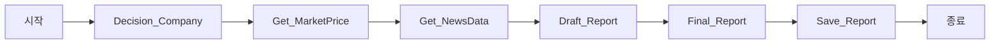

# 🏢 기업 분석 자동화 시스템 (LangGraph Agent)

[](https://www.python.org/)
[](https://www.langchain.com/)
[](LICENSE)

**국내 상장 기업의 투자 분석 리포트를 자동으로 생성하는 AI 에이전트 시스템**

회사명만 입력하면 티커 추출부터 뉴스 수집, 밸류에이션 분석, Word 보고서 생성까지 자동으로 수행합니다.

---

## 📋 목차

- [주요 기능](#-주요-기능)
- [시스템 아키텍처](#-시스템-아키텍처)
- [설치 방법](#-설치-방법)
- [사용 방법](#-사용-방법)
- [워크플로우 상세](#-워크플로우-상세)
- [기술 스택](#-기술-스택)
- [성능 및 제한사항](#-성능-및-제한사항)
- [개선 포인트](#-개선-포인트)
- [기여 방법](#-기여-방법)
- [라이선스](#-라이선스)

---

## ✨ 주요 기능

### 🎯 핵심 기능

- **자동 티커 매핑**: 한글 회사명으로 DART + 네이버 금융 활용하여 정확한 티커 추출
- **실시간 시장 데이터**: yfinance를 통한 가격, 밸류에이션 지표 수집
- **AI 기반 뉴스 큐레이션**: 네이버 뉴스 크롤링 + BGE Reranker로 관련성 높은 뉴스 선별
- **LLM 보고서 생성**: GPT-4 또는 Ollama 모델로 구조화된 분석 리포트 작성
- **자동 문서화**: Word(.docx) 파일로 전문적인 보고서 자동 저장

### 📊 생성되는 보고서 구조

1. **회사/사업 개요**: 기업 정보 요약
2. **최근 동향**: 주요 뉴스 및 이벤트 분석
3. **밸류에이션**: PE, PB, 52주 고저 등 지표 평가
4. **리스크 요인**: 투자 리스크 3-5개 항목
5. **한줄 결론**: 객관적 정보 제공 (투자 권유 배제)

---

## 🏗️ 시스템 아키텍처

### LangGraph 워크플로우



### 상태 관리 (CompanyState)

```python
class CompanyState(TypedDict):
    question: str                      # 사용자 질문
    company_hint: str                  # 회사명/티커 힌트
    ticker: str                        # 확인된 티커 (예: 005930.KS)
    company_name: str                  # 회사명
    price_df: pd.DataFrame            # 6개월 가격 데이터
    market_price_snapshot: dict       # 시가총액, PE, PB 등
    news: List[dict]                  # 큐레이션된 뉴스
    notes: List[str]                  # 진행 로그
    analysis_draft: str               # LLM 생성 초안
    final_report: str                 # 최종 보고서
```

---

## 🚀 설치 방법

### 1. 요구사항

- Python 3.8 이상
- OpenAI API 키 (또는 Ollama 로컬 LLM)
- DART API 키 (필수)

### 2. 저장소 클론

```bash
git clone https://github.com/your-username/company-analysis-agent.git
cd company-analysis-agent
```

### 3. 의존성 설치

```bash
pip install -r requirements.txt
```

**주요 패키지:**
```
langchain
langgraph
langchain-openai
langchain-ollama
yfinance
dart-fss
pandas
rapidfuzz
beautifulsoup4
python-docx
duckduckgo-search
```

### 4. 환경 변수 설정

`.env` 파일 생성:

```env
OPENAI_API_KEY=your_openai_api_key_here
DART_API_KEY=your_dart_api_key_here
```

**DART API 키 발급**: [DART 오픈 API](https://opendart.fss.or.kr/)

---

## 💻 사용 방법

### 기본 실행

```bash
python 기업분석_langgraph_myagent_final_v4.py
```

### 사용 예시

```
투자 분석할 국내 상장 기업 이름 입력(종료 exit) : 삼성전자

[검색어] 삼성전자
국내 상장 종목 심볼(티커) :  005930.KS
티커 매핑 성공
...
=====================================================================

# 기업 분석 리포트
- 기준일: 2026-01-22
- 대상: SAMSUNG ELECTRONICS (005930.KS)

[회사/사업 개요]
삼성전자는 반도체, 디스플레이, 스마트폰 등을 생산하는 글로벌 전자기업...

[최근 동향]
- 미국 AI 반도체 수요 증가로 HBM3E 공급 확대
- 갤럭시 S25 출시 예정
...
```

### 출력 파일

- `{회사명}_기업분석_리포트.docx`: Word 형식 보고서

---

## 🔍 워크플로우 상세

### 1️⃣ Decision_Company (티커 추출)

**기능**: 사용자 입력 회사명 → 정확한 티커 매핑

**프로세스**:
```python
1. DART API로 전체 기업 리스트 수집
2. rapidfuzz로 유사도 기반 회사명 매칭 (cutoff=75)
3. 네이버 금융 크롤링으로 KOSPI(.KS) / KOSDAQ(.KQ) 구분
4. yfinance로 티커 유효성 검증
```

**장점**:
- 한글 회사명으로도 정확한 매칭
- 약어/별칭 처리 가능 (예: "네이버" → "NAVER")

### 2️⃣ Get_MarketPrice (시장 데이터)

**수집 데이터**:
- 6개월 일별 가격 (OHLCV)
- 시가총액, PE, PB 비율
- 52주 최고/최저가
- 업종 분류

**데이터 소스**: Yahoo Finance API

### 3️⃣ Get_NewsData (뉴스 큐레이션)

**프로세스**:
```python
1. 네이버 뉴스 검색 (쿼리: "{회사명} 실적")
2. 최신 20개 URL 수집
3. 본문 추출 (BeautifulSoup)
4. BGE Reranker로 관련성 점수 계산
5. 상위 5개 선별
```

**Reranker 사용 이유**:
- 단순 키워드 매칭 대비 정확도 향상
- 제목만으로 판단하기 어려운 기사 필터링

### 4️⃣ Draft_Report (LLM 보고서 작성)

**LLM 선택**:
- OpenAI: `gpt-4o-mini` (기본값)
- Ollama: `llama3.1` (로컬 실행)

**프롬프트 구조**:
```python
REPORT_PROMPT = ChatPromptTemplate([
    ("system", "당신은 기업 애널리스트입니다..."),
    ("user", """
    질문: {question}
    회사명: {company_name} / 티커: {ticker}
    가격 스냅샷: {market_price_snapshot}
    최근 뉴스: {news_Top_data}
    
    작성 지침:
    1) 회사/사업 개요
    2) 최근 동향 (불릿 3-5개)
    3) 밸류에이션 체크
    4) 리스크 요인 3-5개
    5) 한줄 결론
    """)
])
```

### 5️⃣ Final_Report & Save_Report

**최종 처리**:
- 헤더 추가 (기준일, 회사명, 티커)
- 면책조항 삽입
- Word 문서 스타일링 (Malgun Gothic, 11pt)

---

## 🛠️ 기술 스택

| 카테고리 | 기술 | 용도 |
|---------|------|------|
| **프레임워크** | LangGraph | 상태 기반 워크플로우 관리 |
| **LLM** | OpenAI GPT-4 / Ollama | 보고서 생성 |
| **데이터 수집** | yfinance, DART API, BeautifulSoup | 시장 데이터 및 공시 정보 |
| **텍스트 검색** | rapidfuzz, BGE Reranker | 회사명 매칭 및 뉴스 필터링 |
| **문서 생성** | python-docx | Word 파일 자동 생성 |
| **웹 크롤링** | requests, BeautifulSoup | 네이버 금융/뉴스 수집 |

---

## 📊 성능 및 제한사항

### ✅ 강점

| 항목 | 평가 | 설명 |
|------|------|------|
| **자동화 수준** | ⭐⭐⭐⭐⭐ | 입력 → 출력 완전 자동화 |
| **국내 시장 특화** | ⭐⭐⭐⭐⭐ | DART, 네이버 등 한국 데이터 소스 활용 |
| **확장성** | ⭐⭐⭐⭐☆ | LangGraph 노드 추가 용이 |
| **실용성** | ⭐⭐⭐⭐⭐ | 실무 적용 가능 수준 |

### ⚠️ 제한사항

1. **국내 상장사 한정**: 해외 기업 분석 불가
2. **뉴스 소스 의존**: 네이버 뉴스 크롤링 실패 시 대체 수단 제한적
3. **단순 밸류에이션**: PE, PB만 활용 (ROE, EV/EBITDA 미포함)
4. **동기식 처리**: 순차 실행으로 속도 제한 (비동기 처리 필요)

### 📈 성능 벤치마크

- **평균 실행 시간**: 30-60초 (회사당)
  - 티커 추출: 5초
  - 시장 데이터: 3초
  - 뉴스 크롤링: 15초
  - LLM 보고서 생성: 10초
  - Word 저장: 2초

---

## 🔧 개선 포인트

### 1. 에러 핸들링 강화

**현재 문제**:
```python
info = yf.Ticker(ticker_name).get_info() or {}
```

**개선안**:
```python
try:
    info = yf.Ticker(ticker_name).get_info()
    if not info or 'shortName' not in info:
        raise ValueError("Invalid ticker data")
except Exception as e:
    add_note(state, f"[Error] 티커 정보 획득 실패: {e}")
    state["ticker"] = None
    return state
```

### 2. 뉴스 소스 다변화

**추가 데이터 소스**:
- 다음 뉴스, 구글 뉴스
- 기업 공식 보도자료 (IR 페이지)
- 증권사 리포트 (유료 API)

### 3. 고급 밸류에이션 지표

**추가 지표**:
```python
"ROE": info.get("returnOnEquity"),
"EV/EBITDA": info.get("enterpriseToEbitda"),
"dividend_yield": info.get("dividendYield"),
"debt_to_equity": info.get("debtToEquity")
```

### 4. 비동기 처리 도입

**asyncio 활용**:
```python
import asyncio

async def parallel_data_collection(state):
    tasks = [
        get_market_price_async(state),
        get_news_data_async(state)
    ]
    results = await asyncio.gather(*tasks)
    return results
```

### 5. LLM 프롬프트 고도화

**섹션별 프롬프트 분리**:
```python
# Chain-of-Thought 적용
1. 먼저 회사 개요 생성
2. 개요를 바탕으로 리스크 분석
3. 리스크와 뉴스를 종합하여 결론 도출
```

---

## 🚀 확장 아이디어

### 1. 재무제표 분석 노드 추가

```python
def Get_FinancialStatements(state: CompanyState):
    """
    DART에서 사업보고서 추출
    - 매출/영업이익/순이익 3개년 추세
    - 부채비율, 유동비율 변화
    """
    corp_code = state.get("corp_code")
    fs_data = dart.get_financial_statement(corp_code)
    state["financial_data"] = fs_data
    return state
```

### 2. 경쟁사 비교 기능

```python
def Compare_Competitors(state: CompanyState):
    """
    동일 업종 Top 3 경쟁사 자동 추출
    - 시가총액, PER, 성장률 비교 테이블
    """
    industry = state["market_price_snapshot"]["industry"]
    competitors = find_top_competitors(industry, n=3)
    state["competitor_analysis"] = compare_metrics(competitors)
    return state
```

### 3. 실시간 대시보드

```python
# Streamlit 기반 웹 UI
import streamlit as st

st.title("기업 분석 자동화 시스템")
company_name = st.text_input("회사명 입력")
if st.button("분석 시작"):
    with st.spinner("분석 중..."):
        report = run_analysis(company_name)
    st.markdown(report)
    st.download_button("리포트 다운로드", report, "report.docx")
```

### 4. 다국어 지원

```python
# 미국 주식 분석
ticker_mapping = {
    "Apple": "AAPL",
    "Microsoft": "MSFT"
}

# SEC EDGAR API 활용
def get_us_company_data(ticker):
    ...
```

---

## 🤝 기여 방법

### 이슈 제보

버그 발견 또는 기능 제안은 [GitHub Issues](https://github.com/your-username/company-analysis-agent/issues)로 남겨주세요.

### Pull Request

1. Fork the repository
2. Create your feature branch (`git checkout -b feature/AmazingFeature`)
3. Commit your changes (`git commit -m 'Add some AmazingFeature'`)
4. Push to the branch (`git push origin feature/AmazingFeature`)
5. Open a Pull Request

### 코딩 컨벤션

- PEP 8 준수
- 타입 힌트 사용 (`typing` 모듈)
- Docstring 작성 (Google Style)

---

## 📝 라이선스

이 프로젝트는 MIT 라이선스 하에 배포됩니다. 자세한 내용은 [LICENSE](LICENSE) 파일을 참조하세요.

---

## 👨‍💻 개발자

- **작성자**: [Your Name]
- **이메일**: your.email@example.com
- **GitHub**: [@your-username](https://github.com/your-username)

---

## 🙏 감사의 말

이 프로젝트는 다음 오픈소스 프로젝트의 도움을 받았습니다:

- [LangChain](https://github.com/langchain-ai/langchain)
- [LangGraph](https://github.com/langchain-ai/langgraph)
- [yfinance](https://github.com/ranaroussi/yfinance)
- [dart-fss](https://github.com/josw123/dart-fss)

---

## 📚 참고 자료

- [LangGraph 공식 문서](https://langchain-ai.github.io/langgraph/)
- [DART 오픈 API 가이드](https://opendart.fss.or.kr/guide/main.do)
- [yfinance Documentation](https://pypi.org/project/yfinance/)

---

**⭐ 이 프로젝트가 유용하다면 Star를 눌러주세요!**

